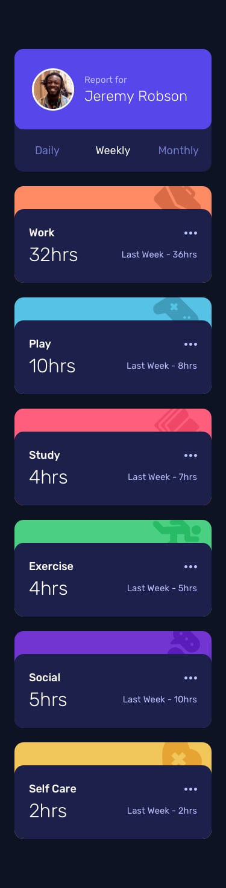

# Frontend Mentor - Time tracking dashboard solution

This is a solution to the [Time tracking dashboard challenge on Frontend Mentor](https://www.frontendmentor.io/challenges/time-tracking-dashboard-UIQ7167Jw). Frontend Mentor challenges help you improve your coding skills by building realistic projects. 

## Table of contents

- [Overview](#overview)
  - [The challenge](#the-challenge)
  - [Screenshot](#screenshot)
  - [Links](#links)
- [My process](#my-process)
  - [Built with](#built-with)
  - [What I learned](#what-i-learned)
  - [Continued development](#continued-development)
- [Author](#author)
- [Acknowledgments](#acknowledgments)

## Overview

### The challenge

Users should be able to:

- View the optimal layout for the site depending on their device's screen size
- See hover states for all interactive elements on the page
- Switch between viewing Daily, Weekly, and Monthly stats

### Screenshot

<ins>Frontend Mentor's Desktop Design</ins>


<ins>My Desktop Solution</ins>


<ins>Frontend Mentor's Mobile Design</ins>



<ins>My Mobile Solution</ins>


### Links

- Solution URL: [Github](https://github.com/moonji-spoonji/Time-Tracking-Dashboard)
- Live Site URL: [Netlify](https://time-tracking-dashboard-moonji.netlify.app/)

## My process

### Built with

- Semantic HTML5 markup
- CSS custom properties
- Flexbox
- CSS Grid

### What I learned

#### JS

I learned to use a map for displaying the data from the json file. 

```js
if(selectedTime === "Daily") {
  data.map((card, index) => {
    title[index].innerText = card.title;
    current[index].innerText = `${card.timeframes.daily.current}${card.timeframes.daily.current === 0 || card.timeframes.daily.current > 1 ? "hrs" : "hr"}`;
    previous[index].innerText = `Yesterday - ${card.timeframes.daily.previous} ${card.timeframes.daily.previous === 0 || card.timeframes.daily.previous ? "hrs" : "hr"}`;
  })
}
```

### Continued development

I want to continue improving on my JS DOM skills and working with APIs and JSON files. Next time I might make it a bit more complicated by creating HTML elements within JS, making my HTML file more bare/simple. I'm not the most logically-adept person especially if I've never encountered a particular issue before, so JS as a whole is a major struggle area for me that I need to overcome. 

## Author

- Frontend Mentor - [@moonji-spoonji](https://www.frontendmentor.io/profile/moonji-spoonji)

## Acknowledgments

I'd like to tip my hat to [@maobugichi](https://www.frontendmentor.io/profile/Maobugichi) on Frontend Mentor because his solution helped me figure out what went wrong with my own project! I also reused some of their formatting for the previous hours and such. 
